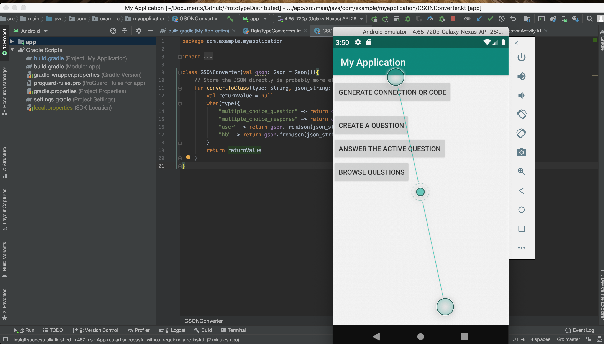
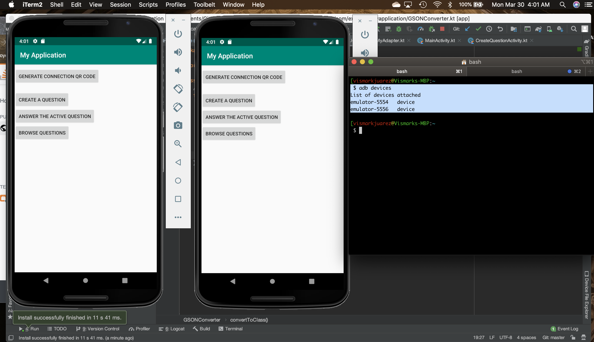
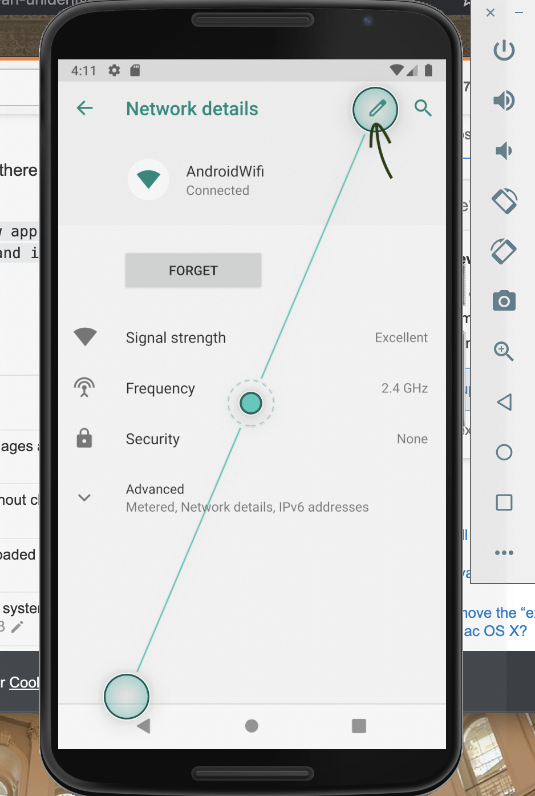
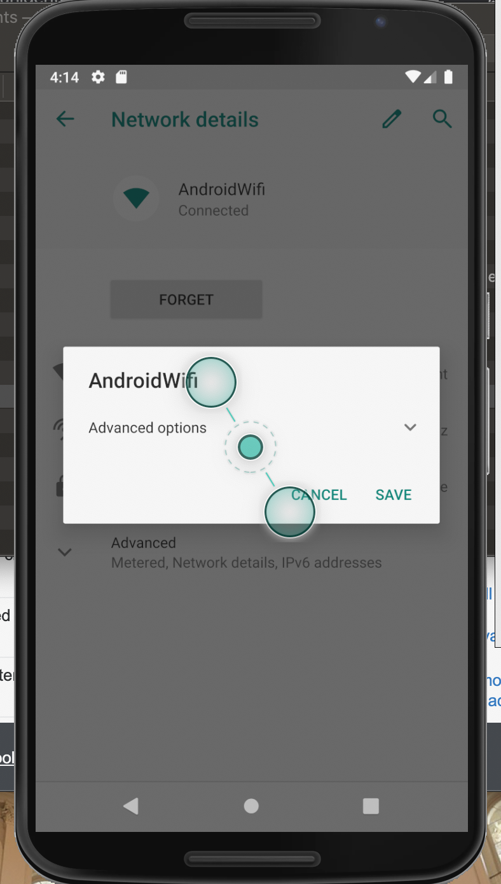
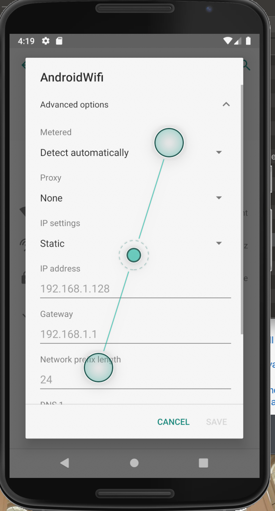
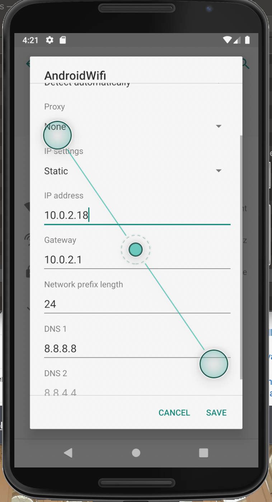
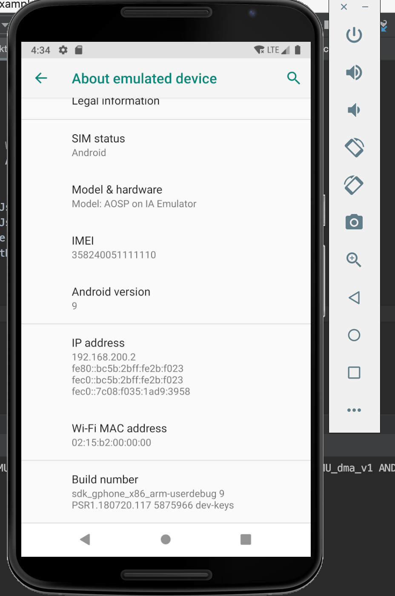
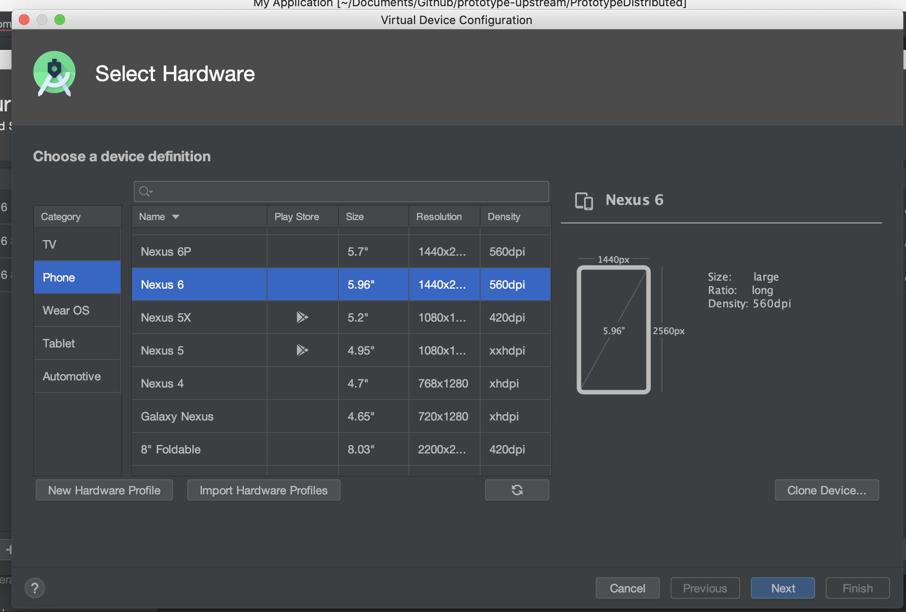
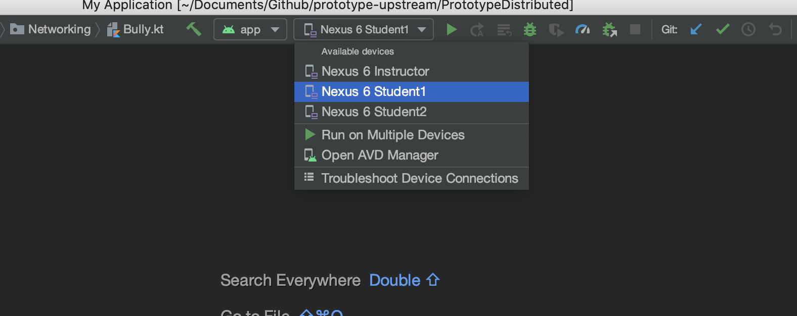

# Running the Application via an Emulator

### Configuring Emulator Port-Forwarding on MacOSX:

1). Install `adb` with the following `brew` command:

```bash
$ brew cask install android-platform-tools

==> Downloading https://dl.google.com/android/repository/platform-tools_r29.0.6-
######################################################################## 100.0%
==> Verifying SHA-256 checksum for Cask 'android-platform-tools'.
==> Installing Cask android-platform-tools
==> Linking Binary 'adb' to '/usr/local/bin/adb'.
==> Linking Binary 'dmtracedump' to '/usr/local/bin/dmtracedump'.
==> Linking Binary 'etc1tool' to '/usr/local/bin/etc1tool'.
==> Linking Binary 'fastboot' to '/usr/local/bin/fastboot'.
==> Linking Binary 'hprof-conv' to '/usr/local/bin/hprof-conv'.
==> Linking Binary 'mke2fs' to '/usr/local/bin/mke2fs'.
🍺  android-platform-tools was successfully installed!
```

2). Verify that `adb` was installed correctly by opening Android Studio and launching a device emulator instance (the kind of device does not matter).



Leave the emulator device running. `adb`can detect any active emulator instances. Run the following command to list all of the instances that `adb` has detected.  The emulator instance, along with its port number, will be displayed.

```bash
$ adb devices
List of devices attached
emulator-5554	device
```

If multiple devices were running, the `adb devices` command would return a list of all running emulators. The example above shows a list of emulators when a single emulator instance exists, the following list will be displayed if two emulators are running simultaneously:



```bash
$ adb devices
List of devices attached
emulator-5554	device
emulator-5556	device
```

3). Choose one of the emulators to behave as the server. In this walkthrough, the emulator named `emulator-5554` will be configured to run as the server.  The configuration steps are as follows:

a. Navigate to `Settings -> Network & internet -> Wi-Fi -> AndroidWiFi`.  Then, click on the edit button on the top right-hand side of the screen:



b. This will open a pop-up. Click on `Advanced Options`:



c. You are will now be able to modify the device's network settings. First, you'll notice the `IP Settings` are `DHCP` by default. Click on the `IP Settings` drop-down and select `static`.  You will now see a form that looks like below:



d. Populate the `IP address` section with the IP `10.0.2.18` as follows:



e. Click on `SAVE`.

### Enable the Server Emulator's `Developer Mode`

On your Server emulator device, navigate to `Settings -> About emulated device`.  Now, scroll all the way to the bottom of the screen, and click on the `Build number` label 7 times. This will activate `Developer Mode` and will automatically allow USB debugging on your emulator:



### Configuring Port Forwarding on the Server Emulator:

1). Now that your emulator is configured, you need to configure adb to forward packets to your emulator.  To do this, run the following command to telnet into your emulator, which is running on port 5554 (as specified in the following command):

```bash
$ telnet localhost 5554
Trying ::1...
Connected to localhost.
Escape character is '^]'.
Android Console: Authentication required
Android Console: type 'auth <auth_token>' to authenticate
Android Console: you can find your <auth_token> in
'/Users/vismarkjuarez/.emulator_console_auth_token'
OK
```

2). As seen in the output message above, you will be prompted to enter an authentication token (`Android Console: you can find your <auth_token> in
'/Users/vismarkjuarez/.emulator_console_auth_token'`) . You will also be given the exact location for this token. Navigate to the exact file directory shown to you, retrieve your unique identification token, copy it and paste it as an argument in the telnet session as follows:
```bash
auth Bakox7Ngcdg0jJ6a
```

Up to this point, your telnet command prompt output should look somewhat like this:
```bash
$ telnet localhost 5554
Trying ::1...
Connected to localhost.
Escape character is '^]'.
Android Console: Authentication required
Android Console: type 'auth <auth_token>' to authenticate
Android Console: you can find your <auth_token> in
'/Users/vismarkjuarez/.emulator_console_auth_token'
OK
auth Bakox7Ngcdg0jJ6a
Android Console: type 'help' for a list of commands
OK
```

3). You are now ready to send commands to your emulator. The only command you need to make on your server emulator is the following:

```bash
redir add udp:5000:5024
```

That will redirect the appropriate data to your server emulator.

## Configuring Port-forwarding on the Client 1 Emulator:

Aside from setting up the Server emulator (as described above), you can configure port-forwarding communication for up to two additional emulators.  To have two additional emulators communicate with eachother, follow the following steps:

 1). Start a new Nexus 6 emulator instance on Android studio.  You can do this by creating a new emulator on Android Studio, and selecting it as the target emulator when runningt the app. To create a new emulator and run the app on it, folow the following steps:

1.a). In Android Studio, create a new emulator.  You can do this by navigating to clicking on the emulator selection drop-down and clicking on `Open AVD Manager`, as shown below:


1.b). Now, click on the `Create Virtual Device` button on the bottom left-hand corner of the AVD Manager dialogue box.  This will open a new dialogue box titled `Select Hardware`, where you can specify what kind of phone you want your new emulator to be. Select `Nexus 6` on the list on phones, and click `next`:



1.c). Now, you will be redirected to a `System Image` screen where you need to specify the target API level for your device. Select API level 29 (`Q`) and click `Next`:


1.d). Finally, give your new device a name.  It may help to name the emulator `client1` or `student1`, or `client2` or `student2` since the individual client emulators will also have their own static IP's set (just like the server in the `Configuring Emulator Port-Forwarding` section); this will keep you from getting confused
on which emulator is which client. Click on `Finish` when you're done:


1.e). Now, on Android Studio, click on the emulator drop-down list again. You should now see your new emulator's name (`student1` in this case).  Click on it. Now, the next time you run the Android app, the `student1` emulator will be the emulator it runs on:




2). Now, you'll need to configure the new emulator's static IP.  To do so, follow the following steps:

2.a). Run the application on your new device. The process for selecting the new emulator is outlined on step 1.e. Then, click the green "play button" to run your application on that device.

2.b). Now that your new emulator is running, navigate to `Settings -> Network & internet -> Wi-Fi -> AndroidWiFi`.  Then, click on the edit button on the top right-hand side of the screen:


2.c). This will open a pop-up. Click on `Advanced Options`:


2.d). You are will now be able to modify the device's network settings. First, you'll notice the `IP Settings` are `DHCP` by default. Click on the `IP Settings` drop-down and select `static`.  You will now see a form that looks like below:


2.e). Populate the `IP address` section with the IP `10.0.2.17` as follows:


2.f). Click on `SAVE`.


3). Now, you can configure port-forwarding on this device. To do so, follow the following steps:

a). Telnet into the client emulator device:
```bash
telnet localhost 5556
```

b). Authenticate:

```bash
auth xFrXqZnNxq0yqeBy
```

c). Run the following command to redirect data to the device:
```bash
redir add udp:5023:6000
```

d). Now, you can re-run your application on this device, and when the device starts up, and you enter a userName, create a quiz or join a quiz, you should see the heart-beat toast messages appear roughly every 30 seconds.  You have successfully configured and port-forwarder your emulators.


## Configuring Port-forwarding on the Client 2 Emulator:

Repeat steps 1 through 3 in the `Configuring Port-forwarding on the Client Emulator` section to create a third emulator and configure its static IP.  The static IP is the same (`10.0.2.17`).

The telnet device number will be 5556:
```bash
telnet localhost 5556
```

And the redirection port forwarding command will be:

```bash
redir add udp:5026:6000
```

# Static IP Setup & Configuring Port Forwarding TLDR:

1. configure emulator static IPs:
- Instructor (aka Server): `10.0.2.18`
- Student1 (aka Client1): `10.0.2.17`
- Student2 (aka Client2): `10.0.2.17`

2. Telnet into each emulator:
- Instructor (aka Server): `telnet localhost 5554`
- Student1 (aka Client1): `telnet localhost 5556`
- Student2 (aka Client2): `telnet localhost 5558`

3. Configure redirection once a successful Telnet connection has been established to each emulator (Remember to authenticate first: `auth <yourToken>`):
- Instructor (aka Server): `redir add udp:5000:5024`
- Student1 (aka Client1): `redir add udp:5023:6000`
- Student2 (aka Client2): `redir add udp:5026:6000`

# Static IP Setup & Configuring Port Forwarding TLDR was T
```bash
ADB Redirection Command | Emulator instance ID | Emulator Static IP

redir add udp:5000:5024     (5554)instructor         10.0.2.18
redir add udp:5023:6000     (5556)student1           10.0.2.17
redir add udp:5026:6000     (5558)student2           10.0.2.17
```
